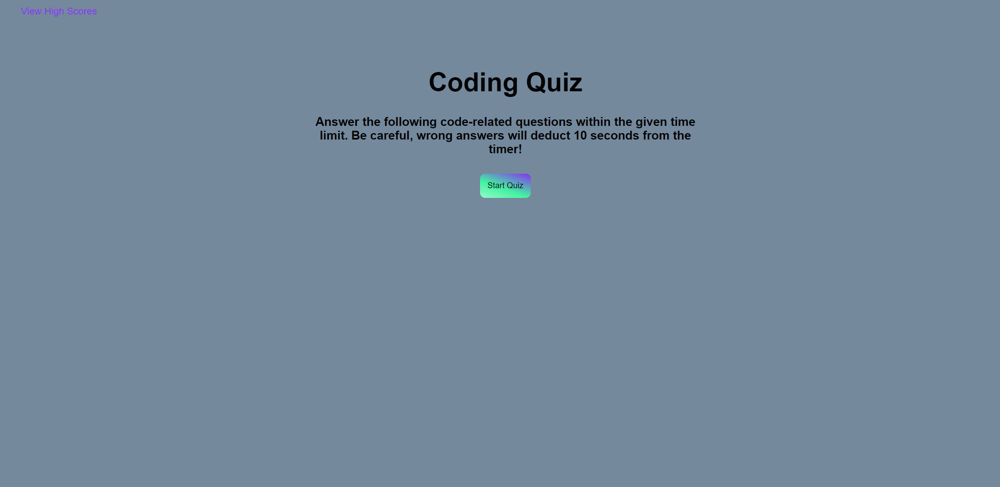
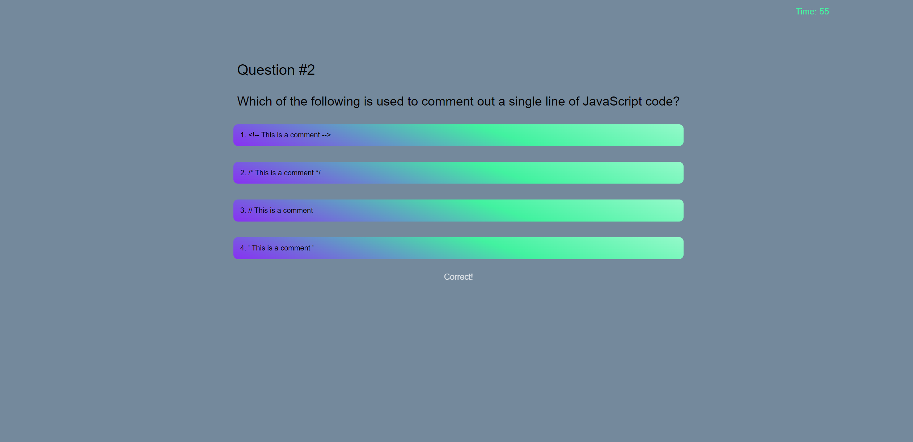
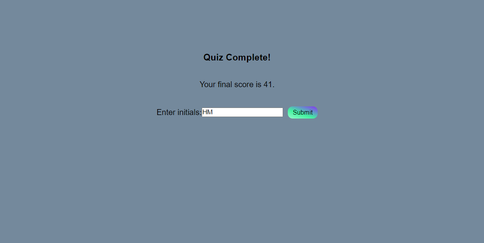
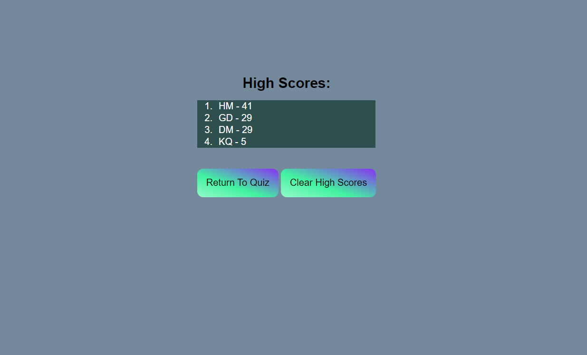

# Web API Code Quiz

This web app allows the user to take a coding quiz and keeps track of and displays their high scores. The HTML and CSS are dynamically updated through JavaScript allowing the user to answer questions and also view and reset the high score list.

The deployed web app can be found at <https://huntermuratore.github.io/web-api-code-quiz/>

